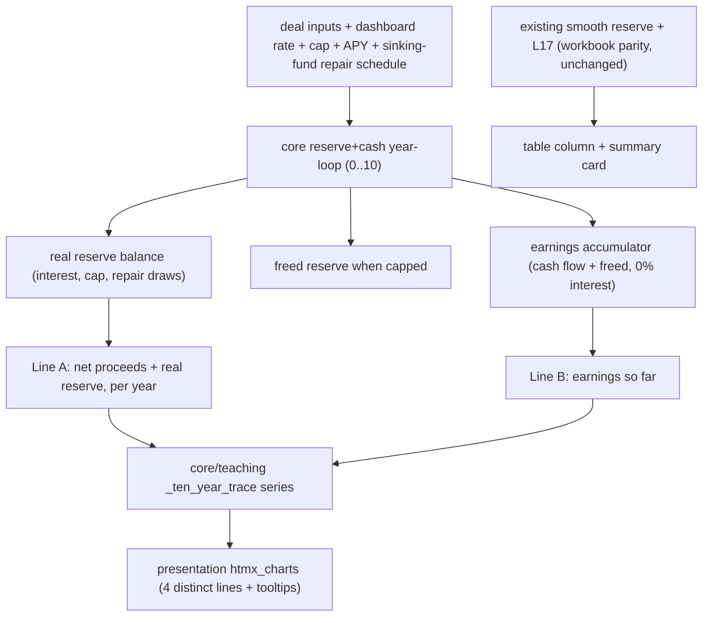

# Reserve timeline charts — implementation slice

**Status:** design locked for the two lines; two definitional questions open (see end).  
**Scope grew:** this now requires a **core year-loop merge** (the handoff "single source of truth"), not just relabeling. Lines are derived from one reserve+cash loop that includes repair draws.

**Boundary contract:** core stays HTTP/file/browser-free and owns all math; `core/teaching` reads the core result and shapes series; presentation renders only. No invented metrics in presentation.

---

## The two lines (decided)

Both lines **start at $0 in year 0** and show what has happened since purchase.

### Line A — "Sell-now wealth" (legend short; full text in tooltip + note)
- **Meaning:** what you'd walk away with if you sold *that* year.
- **Formula per year:** `net sale proceeds(year) + reserve ending balance(year)`.
- The reserve piece is the **real** fluctuating, interest-earning, repair-depleted balance — added **every year**, not just year 10 (today the reserve addback only lands at year 10).
- Honest note: "Net sale proceeds plus your current repair-fund balance, each year."

### Line B — "Earnings so far" (legend short; full text in tooltip + note)
- **Meaning:** cash you've actually earned and could have spent — "like stock-market earnings: at any point, this is how much you've made."
- **Formula per year (accumulator):**
  - `+ true cash flow` (already net of the monthly reserve set-aside),
  - `+ freed reserve money in years the fund is capped` (cap-overflow rolls into earnings, as the pro forma already does today),
  - **0% interest** (assumed spent),
  - when a **repair depletes** the reserve, set-aside **restarts**, so the freed-money roll-in pauses until the fund refills — less goes to earnings in those years.
- Honest note: "Cash flow after monthly set-aside; capped-reserve overflow rolls in; 0% interest because it is likely spent; set-aside resumes after a repair drains the fund."

---

## Why core must change (additive truth — decided)

Today there are two reserve stories:
- `_compute_pro_forma` -> smooth `accumulatedCapexReserve` (no repair draws) + `accumulatedTrueCashFlow` with cap-overflow; `realEstateLiquidationWealth` (L17) built on the smooth reserve. **These are workbook-parity and stay exactly as-is.**
- `compute_repair_reserve_path_trace` -> real reserve with contributions, interest, cap, repair draws (`endingBalance`).

**Decision (additive truth):** keep the smooth reserve + L17 untouched for the 17-case workbook gate. **Add** new app-only calculation-truth fields for the chart's real story: a reserve-with-draws balance, `sellNowWealth`, and `earningsSoFar`. The chart draws the honest real-draws lines; the table/summary keep workbook L17.

Consequence to remember: **Y10 `sellNowWealth` will NOT equal L17** — L17 uses the smooth (undepleted) reserve, while Sell-now uses the real reserve after repair draws. That difference is intentional and should be teachable, not "fixed."

### Plan: one reserve+cash year-loop in core, feeding new fields
Extend the reserve loop (in `core/repair_reserve_path_trace.py` or a unified function called by `calculate_rental_capex`) so each year emits the real reserve balance, the freed-when-capped amount, and the earnings accumulator. `_compute_pro_forma` keeps its existing smooth-reserve/L17 math and **additionally** attaches the new fields per year. No existing field changes value.



---

## Architecture boundaries and ambiguities (per `tmp/domain-spoke-architecture.md`)

Stack constraint (locked): **Python + htmx, server-rendered SVG, zero JavaScript.** Loss band, zero line, color fixes, and rollovers all ship as SVG/CSS (native SVG `<title>`, HTML `title`, CSS `:hover`). No JS is added. If any future interaction genuinely cannot be done without JS, it becomes its own decision, not a quiet addition here. (`browser_javascript_policy: minimal`.)

### The one ownership change -> ACCEPTED (decision resolved)

`compute_repair_reserve_path_trace` was described in `core/AGENTS.md` as a **teaching-adjacent numeric trace** (A4: teaching-only, not workbook-parity). **Decision accepted 2026-06-14:** it is promoted to **domain-center calculation truth**. The app has exceeded the workbook standard it once mirrored, so the real reserve timeline (with repair draws) is app-owned truth, covered by **app-only regression cases**, while the existing smooth-reserve/L17 fields remain workbook-parity.

```lisp
(architecture_decision_slice
  (question "Is the reserve timeline (contributions, interest, cap, cap-overflow, repair draws) domain-center calculation truth, or a teaching-adjacent trace?")
  (status accepted)
  (current_owner "core teaching-adjacent trace: core/repair_reserve_path_trace.py; A4 teaching-only")
  (proposed_owner "core domain-center calculation truth: reserve+cash year-loop emitting real reserve, sellNowWealth, earningsSoFar as new pro forma fields")
  (decision "additive truth: keep smooth accumulatedCapexReserve + L17 as workbook-parity, unchanged; add real-draws reserve + sellNowWealth + earningsSoFar as app-owned calculation truth")
  (parity_status "new fields = app-only regression cases (not 17-case workbook parity); existing 17-case rows untouched and stay green")
  (rejected_options
    (option (name "Full divergence: overwrite L17/accumulatedCapexReserve with draws")
            (reason "would break/retire workbook 17-case rows; not needed when additive keeps the gate green"))
    (option (name "Compute the addition in teaching/presentation")
            (reason "presentation/teaching must not own calculation policy; violates doctrine")))
  (proof_to_accept "core/AGENTS.md ownership + parity lines updated; 17-case gate green; new app-only regression cases for real reserve, sellNowWealth, earningsSoFar")
  (implementation_allowed true))
```

### Layer ownership for the rest (no ambiguity, stated for proof)

- **Domain center owns the numbers.** `reserveEndingBalance`, `freedReserve`, `earningsSoFar`, `sellNowWealth` are computed in core (`repair_reserve_path_trace.py` + `_compute_pro_forma`) and emitted on pro forma rows. Dependency stays inward (core -> core); the reserve loop is computed before pro forma consumes it, no cycle.
- **Teaching shapes the view, not the math.** `core/teaching/calculation_result_traces.py` assembles series, labels, source notes, and the honest bottom note from core fields. It must not add `netProceeds + reserve` or accumulate earnings itself.
- **Presentation renders only.** `htmx_charts.py` / `htmx_evidence.py` / `tokens.css` draw the four lines, zero line, red loss band, tooltips, and table columns from precomputed values. Templates/fragments must not calculate domain values (doctrine architecture-test rule).
- **Autonomy framing is presentation-only copy** (teaching copy), explicitly modeled as copy that does not change calculation behavior. The deferred spend/reinvest toggle is different: it would change behavior, so it becomes a **domain policy** decision when/if taken, not presentation logic.

### Proof the boundaries held
- `tests/test_architecture_gates.py` stays green (no new cross-layer imports; no presentation JS beyond `vendor/htmx.min.js`).
- Add/keep a proof that the chart and table read precomputed `sellNowWealth`/`earningsSoFar` rather than computing them (guard against presentation owning calc policy).

## Files and edits

### 1. Core — unified loop
- `src/capex3/core/repair_reserve_path_trace.py`: per-year already has contributions/interest/cap/repair draws/`endingBalance`. Add the **freed-when-capped** amount and an **earnings accumulator** to each year row, with restart-after-depletion behavior.
- `src/capex3/core/calculate_rental_capex.py` `_compute_pro_forma`: **keep** the existing smooth `accumulatedCapexReserve`, `accumulatedTrueCashFlow`, and `realEstateLiquidationWealth` (L17) math unchanged (workbook parity). **Additionally** attach the reserve loop's per-year `reserveEndingBalance` (real, with draws), `freedReserve`, and `earningsAccumulator`. Add per-year row fields:
  - `reserveEndingBalance` (real balance, with repair draws),
  - `sellNowWealth` = `netProceeds + reserveEndingBalance` (every year; **not** equal to L17 at Y10 by design),
  - `earningsSoFar` (accumulator).
- Keep existing `realEstateLiquidationWealth` (L17) unchanged for parity/summary/table. Line A on the chart uses `sellNowWealth` every year (Y0..Y10), which uses the real reserve and so **diverges from L17 at Y10** — document this divergence, do not "reconcile" it.

### 2. Teaching — `core/teaching/calculation_result_traces.py` `_ten_year_trace`
- Replace `cashFlow` (cash position) series. New `graph.series`:
  - `id: "sellNow"`, label short (legend), `values: [row["sellNowWealth"]]`, `sourceNote`: Line A honest note.
  - `id: "earnings"`, label short, `values: [row["earningsSoFar"]]`, `sourceNote`: Line B honest note.
  - keep `moneyMarket`, `conservativeIra`.
- Both series start at 0 (year 0). (See open question on Line A year-0 baseline.)
- Rewrite `note` to the honest bottom-of-chart explanation (can be two short sentences, since it replaces the explanatory line).
- Summary cards keep L17/B28 parity wording unchanged.

### 2b. Presentation chart — below-zero handling (Sell-now wealth can go negative for years)

Vertical space is already automatic: the 10-Year chart calls `_value_bounds` **without** `floor_at_zero`, so `min_y` tracks the actual minimum and negative values render in-bounds with no clipping. No manual space reservation needed. The gaps are about making zero legible:

- **Draw a zero reference line.** In `_axis_markup` (or the ten-year SVG), when `min_y < 0 < max_y`, add a distinct horizontal rule at value 0 (`_point(0, 0.0, ...)`), styled stronger than `chart-grid` and separate from the floor `chart-baseline`. Label it `$0` / "break-even."
- **Fill Line A's area to the zero line, not the floor.** Today `_area_path` uses `baseline_y` (plot floor). Compute a `zero_y = _point(0, 0.0, ...)` and use it as the area baseline so positive area shades up from zero and the underwater stretch is not falsely filled.
- **Signal underwater with a red loss band (accepted).** Shade the sub-zero region red and/or recolor the below-zero portion of the line so a negative year reads instantly as "you'd take a loss if you sold this year." Red-for-loss is universally understood. Pure SVG/CSS, no JS.
- Confirm `_format_chart_k` and endpoint labels render negative values cleanly (leading minus, not overlapping the floor labels).

### 3. Presentation chart — `htmx_charts.py`
- `TEN_YEAR_SERIES_CLASSES`: `{rental->sellNow, reserve/earnings, moneyMarket, conservativeIra}` mapped to 4 distinct classes.
- Colors: four unambiguous hues — green (Sell-now), cool blue (Earnings), neutral gray (Money market), amber/copper (IRA). Fix the rust/copper collision (`#a43d12` vs `#b85c28`) and the muddy `#61594a`.
- **Zero-JS rollover tooltips:**
  - Add an SVG `<title>` child to each series `<path>` -> native browser hover tooltip, no JS.
  - Add HTML `title="..."` to each legend swatch/label span -> native hover tooltip.
  - Optional richer styling later via pure CSS `:hover` reveal; not required for the slice.
- Bottom note line carries the longer honest explanation; legend stays terse.

### 4. Presentation tokens/styles — `tokens.css`, `styles.css`
- Repoint/rename `--chart-series-*` so four are distinct; update all `.cash-flow`/series class references.

### 5. Presentation table — `htmx_evidence.py` `_ten_year_section`
- Keep "Cash position (operating + initial)" and "Future property value" as **table-only** columns.
- Relabel the chart-facing header from "Liquidation wealth" to match Line A name (dual-label "(L17)" to preserve parity traceability).

### 6. Fixtures/tests
- **17-case gate untouched:** existing `accumulatedCapexReserve` / `realEstateLiquidationWealth` (L17) expected values in `model-verification-cases.json` stay exactly as-is and must remain green.
- **New app-only regression cases** (not workbook parity): add expected per-year `reserveEndingBalance` (with draws), `sellNowWealth`, `earningsSoFar`. House them in an app-owned test (e.g. extend `tests/test_repair_reserve_path_trace.py` or a new `test_reserve_timeline_truth.py`), mirroring the Phase 5 resilience "app-only" precedent — do **not** add them to the 17-case workbook fixture.
- `tests/test_repair_reserve_path_trace.py`: extend for freed-when-capped and earnings accumulator with restart-after-depletion; update/replace the old "teaching-only / not in the 17-case" `sourceNote` assertions to match the new ownership wording.
- `tests/test_presentation_htmx_renderer.py`: update series-label/class assertions (Sell-now, Earnings); assert both new lines start at 0; keep cash-position **table** assertions.
- Update `core/AGENTS.md` (reserve path trace line) and `tests/fixtures/workbook-parity-matrix.md` A4 row to state the new ownership (calculation truth, app-only regression) instead of "teaching-only."

---

## Verification
1. `python -m compileall src\capex3 tests`
2. `python -m unittest discover -s tests -p "test_*.py" -v` (PYTHONPATH=src)
3. `python -m unittest tests.test_architecture_gates tests.test_fixture_parity`
4. Manual: `.\tools\start-capex4.ps1` -> 10-Year Story shows 4 distinct lines; Sell-now and Earnings both start at $0; below-zero Sell-now shows the red loss band and zero line; Earnings dips/flattens when a repair forces set-aside to resume; hover shows honest tooltips; table still has cash position + future property value (L17 column unchanged).

---

## Behavioral realities — framing (decided: autonomy-weighted, option b)

Stance: spending the cash flow or not fully funding the reserve are the **buyer's own choices**, not failures to warn against. Copy must be neutral, non-prescriptive, and help the buyer decide competently for themselves, while making consequences honest — including how a choice lands on their closest circle.

- **Neutral choice + consequence, routed to the tab that shows it:**
  - "What you can actually spend each month" -> Cash Flow tab (`trueMonthlyCashFlow`).
  - "If you don't set it aside, here's the surprise cost" -> Repair Fund no-reserve comparison path.
  - "If a repair lands unfunded, here's the shock" -> Cash Flow Stability / emergency-debt layer.
- **Short autonomy copy** (one or two lines, no pressure language): affirm it is the buyer's call and name who it touches — themselves and the closest people who depend on the outcome — so the decision is made knowingly. Tone: competence-building, not cautionary.
- **No behavioral toggle in this slice** (spend vs reinvest stays deferred).

Where this copy lives: the honest bottom-of-chart note (Line B) and the relevant tab intro copy. Keep it terse; legend stays short with tooltips.

## Open definitional question (must confirm before coding)
1. **Line A year-0 baseline.** Net sale proceeds at year 0 is not naturally $0 (it is roughly equity minus selling costs). To make Line A "originate at zero," do we (a) anchor year 0 to 0 and plot wealth created since purchase, or (b) subtract initial investment so the line is gain-over-cost? Recommendation: (a) anchor Y0=0, plot absolute sell-now wealth from Y1, label Y0 as the $0 starting point.

---

## Deferred (not this slice)
- Spend/reinvest or yield-on-retained-cash toggle (behavioral modeling) — the buyer-intention modeling raised under autonomy framing.
- Shortfall (negative reserve) styling on the chart line.
- `CONTEXT.md` "five paths" -> "two honest lines + alternatives + table-only cash position" wording, after this ships.
