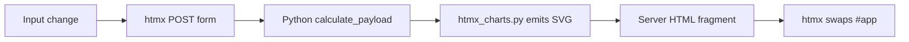

# Server-Rendered SVG Charts Plan

## Goal
Remove Highcharts and the local chart mount script from Capex4, while keeping the existing Python + htmx recalculation flow. The server will emit inline SVG for the 10-year story chart and repair fund chart on every `/ui/calculate` or `/ui/evidence` response.

## Architecture
Keep htmx as the only browser behavior layer. `htmx_charts.py` already owns chart data extraction, bounds, labels, and surrounding HTML; it should finish the job by turning trace series into `<svg>` markup instead of `data-highcharts-config` JSON.



## Files To Change
- `src/capex3/presentation/htmx_charts.py`
  - Remove Highcharts JSON config generation.
  - Add small SVG geometry helpers for points, paths, areas, axes, labels, and repair event markers.
  - Render the 10-year chart and repair fund chart as inline SVG.
- `src/capex3/presentation/htmx_page.py`
  - Remove `HIGHCHARTS_VENDOR_ASSET_PATH`, `CHARTS_SCRIPT_PATH`, and both chart `<script>` tags.
  - Keep `HTMX_VENDOR_ASSET_PATH`.
- `src/capex3/presentation/rental_capex_http_api.py`
  - Remove `charts.js` and `vendor/highcharts.js` from the allowed static asset list.
- `src/capex3/presentation/browser_assets/index.html`
  - Remove the two chart script tags from the static shell copy.
- `src/capex3/presentation/browser_assets/styles.css`
  - Remove `.highcharts-host` rules.
  - Keep and reuse `.svg-wrap`, `.chart-grid`, `.chart-baseline`, `.chart-y-label`, `.chart-x-label`, `.ten-year-series`, `.rental-area`, `.repair-balance-series`, `.repair-surprise-series`, `.repair-event-marker`, and endpoint label styles.
  - Add only small missing selectors if inline SVG needs them, such as `.server-svg-chart` or `.chart-value-table`.
- Delete `src/capex3/presentation/browser_assets/charts.js`.
- Delete `src/capex3/presentation/browser_assets/vendor/highcharts.js`.
- Update tests in `tests/test_presentation_htmx_renderer.py`, `tests/test_focused_verification.py`, and `tests/test_architecture_gates.py` to assert server SVG and absence of chart JS.
- Update root `AGENTS.md` after code changes so the stack policy says htmx-only browser JavaScript and server-rendered SVG charts.
- Refresh `src/capex3/presentation/AGENTS.md` only as navigation: update the `browser_assets/` structure line and chart location note. Do not add policy, conventions, or anti-patterns to subtree `AGENTS.md`.
- Run a repository search for `highcharts`, `charts.js`, `data-highcharts-config`, and `highcharts-host` after edits. Remaining matches should be only historical transcript text outside the repo, not source, tests, docs, or browser assets.

## Implementation Tasks

### Task 1: Lock The New Contract With Tests
Add failing tests before changing implementation.

- In `tests/test_presentation_htmx_renderer.py`, update the 10-year chart test to expect:
  - `id="ten-year-story-chart"`
  - an inline `<svg` inside `.svg-wrap`
  - `class="ten-year-series rental"`
  - `class="ten-year-series cash-flow"`
  - `class="ten-year-series money-market"`
  - `class="ten-year-series ira"`
  - `class="rental-area"`
  - `class="endpoint-label`
  - no `highcharts-host`
  - no `data-highcharts-config`

- In `tests/test_presentation_htmx_renderer.py`, update the repair fund chart test to expect:
  - `id="repair-fund-story-chart"`
  - inline `<svg`
  - `class="repair-balance-series"`
  - `class="repair-surprise-series"`
  - `class="repair-event-marker"`
  - `class="chart-legend repair-fund-legend"`
  - no `highcharts-host`
  - no JSON field like `&quot;step&quot;:&quot;left&quot;`

- In `tests/test_focused_verification.py`, update asset tests so the expected assets are only:
  - `fonts.css`
  - `index.html`
  - `styles.css`
  - `tokens.css`
  - `vendor/htmx.min.js`

- In `tests/test_focused_verification.py`, update `test_browser_assets_are_package_data_resources` and `test_corrective_browser_assets_exist_in_capex3_presentation`; both currently list `charts.js` and `vendor/highcharts.js`.

- In `tests/test_focused_verification.py`, update `test_migrated_index_uses_htmx_static_asset_routes`:
  - Keep assertions for `/assets/tokens.css`, `/assets/styles.css`, `/assets/vendor/htmx.min.js`, htmx routes, and font links.
  - Add assertions that `/assets/vendor/highcharts.js` and `/assets/charts.js` are absent.

- Remove `test_charts_js_remounts_from_live_app_after_htmx_outerhtml_swap`; that behavior disappears with `charts.js`.

- In `tests/test_architecture_gates.py`, change `APPROVED_PRESENTATION_JAVASCRIPT` to only include `Path("browser_assets/vendor/htmx.min.js")`.

- In `tests/test_architecture_gates.py`, update `test_presentation_browser_assets_have_no_app_module_or_request_code` so the scan exclusion contains only `Path("vendor/htmx.min.js")`. Once `vendor/highcharts.js` is deleted, it should not be exempted from the app-code scan.

- In `tests/test_presentation_htmx_renderer.py`, update the page-shell test that currently expects both chart script tags:
  - Keep `src="/assets/vendor/htmx.min.js"`.
  - Assert `src="/assets/vendor/highcharts.js"` is absent.
  - Assert `src="/assets/charts.js"` is absent.

Run:
```powershell
$env:PYTHONPATH = 'src'
python -m unittest tests.test_presentation_htmx_renderer tests.test_focused_verification tests.test_architecture_gates -v
```
Expected before implementation: failures that point to Highcharts markup and asset expectations.

### Task 2: Add Shared SVG Helpers In `htmx_charts.py`
Replace Highcharts helpers with direct SVG helpers. Keep helpers local to `htmx_charts.py`; do not add a new abstraction layer.

Use constants for fixed chart geometry:
```python
SVG_WIDTH = 640
TEN_YEAR_SVG_HEIGHT = 280
REPAIR_FUND_SVG_HEIGHT = 260
CHART_PAD_LEFT = 58
CHART_PAD_RIGHT = 28
CHART_PAD_TOP = 18
CHART_PAD_BOTTOM = 34
```

Add helpers with these responsibilities:
- `_plot_area(height: int) -> tuple[float, float, float, float]`
  - Returns left, top, width, height.
- `_point(index: int, value: float, count: int, min_y: float, max_y: float, height: int) -> tuple[float, float]`
  - Maps year/value to SVG coordinates.
  - If `count <= 1`, center the point horizontally.
- `_line_path(points: Sequence[tuple[float, float]]) -> str`
  - Returns `M x,y L x,y ...`.
- `_area_path(points: Sequence[tuple[float, float]], baseline_y: float) -> str`
  - Closes a line down to the baseline for filled areas.
- `_step_path(points: Sequence[tuple[float, float]]) -> str`
  - Builds the repair surprise path using hold-then-jump segments.
- `_step_area_path(points: Sequence[tuple[float, float]], baseline_y: float) -> str`
  - Closes the stepped path to the baseline.
- `_axis_markup(point_count, min_y, max_y, height) -> str`
  - Emits y tick labels using `_format_chart_k` and x labels using `_year_categories`.
  - Use 4 or 5 y ticks; do not overfit exact Highcharts ticks.
- `_svg_defs(kind: str) -> str`
  - Emits `rentalGrad`, `repairBalanceGrad`, and `surpriseCostGrad` only where used.

Important edge cases:
- Empty series should keep the existing “Evidence trace unavailable” fallback.
- Single-point series should not divide by zero.
- Negative values should map correctly because `_value_bounds` already gives min and max.
- Escape all text labels with `_html` or `_attr` before inserting into SVG attributes or text.

### Task 3: Render The 10-Year Story As SVG
In `_ten_year_chart`, keep series extraction, legend HTML, note, and initial investment copy. Replace `config = _base_highcharts_config(...)` through `_highcharts_host(...)` with inline SVG.

SVG requirements:
- `role="img"` and `aria-label="Total wealth position over 10 years"` on `<svg>`.
- `<title>Total wealth position over 10 years</title>` and a concise `<desc>` inside the SVG.
- Area fill under the rental line using `<path class="rental-area">`.
- Four line paths:
  - `class="ten-year-series rental"`
  - `class="ten-year-series cash-flow"`
  - `class="ten-year-series money-market"`
  - `class="ten-year-series ira"`
- Endpoint groups for non-rental comparison series using existing `.endpoint` and `.endpoint-label` styles.
- Native SVG `<title>` on each endpoint or year group for basic no-JS hover text.

Do not rebuild Highcharts shared tooltips in this task. Preserve exact data truth through the generated paths and the evidence tables already shown below the chart.

### Task 4: Render The Repair Fund Chart As SVG
In `_repair_fund_chart`, keep trace extraction, repair event grouping, legends, copy, and notes. Replace the Highcharts config with inline SVG.

SVG requirements:
- `role="img"` and `aria-label="Reserve balance vs no-reserve surprise cost"`.
- Reserve balance uses a normal line and area:
  - `class="repair-balance-area"`
  - `class="repair-balance-series"`
- No-reserve surprise cost uses a stepped path and area:
  - `class="surprise-cost-area"`
  - `class="repair-surprise-series"`
- Repair events render as `g.repair-event-marker` at the event year x-coordinate.
  - Emit a vertical dashed line, a small circle, and a label like `_format_chart_k(amount) · label`.
  - If multiple repairs share a year, keep existing grouping behavior from `_repair_fund_chart_events`.

Keep `_repair_fund_chart_events` and `_format_chart_k`; rename `_repair_fund_plot_lines` or remove it once no code uses it.

### Task 5: Remove Chart JavaScript From Page And Assets
After SVG tests pass, remove client chart dependencies.

- In `htmx_page.py`, remove:
  - `HIGHCHARTS_VENDOR_ASSET_PATH`
  - `CHARTS_SCRIPT_PATH`
  - `<script src="/assets/vendor/highcharts.js" defer></script>`
  - `<script src="/assets/charts.js" defer></script>`

- In `browser_assets/index.html`, remove the same chart script tags.

- In `rental_capex_http_api.py`, remove these allowed static paths:
  - `PurePosixPath("charts.js")`
  - `PurePosixPath("vendor/highcharts.js")`
  - Keep `PurePosixPath("vendor/htmx.min.js")` in `_CACHEABLE_BROWSER_ASSETS`.

- Delete:
  - `src/capex3/presentation/browser_assets/charts.js`
  - `src/capex3/presentation/browser_assets/vendor/highcharts.js`

Run focused tests again, then search:
```powershell
rg "highcharts|charts\.js|data-highcharts-config|highcharts-host" src tests AGENTS.md
```
Expected: no matches, except no match for `charts.js` as a deleted file and no `highcharts` references in repo source/tests/docs.

### Task 6: Clean CSS And Documentation
Remove CSS that only targets Highcharts:
- `.highcharts-host`
- `.repair-fund-chart .highcharts-host`
- `.highcharts-host .highcharts-container`
- `.highcharts-host .highcharts-root text`

Keep the existing SVG CSS. If visual spacing changes, add a small class such as:
```css
.server-svg-chart {
  min-height: 260px;
}
```

Update docs after the implementation, not before:
- In root `AGENTS.md`, replace the current allowed-JS line with htmx-only browser JavaScript and server-rendered SVG charts.
- In `src/capex3/presentation/AGENTS.md`, keep it navigation-only:
  - Refresh the `browser_assets/` structure line to drop “+ chart JS until SVG migration”.
  - Keep `htmx_charts.py` as the chart markup location.
  - Do not recreate `CONVENTIONS` or `ANTI-PATTERNS` sections there.
- In `htmx_shell.py`, replace the Highcharts sentence with: charts are server-rendered inline SVG from `htmx_charts.py`, refreshed by htmx swaps.

Do not change calculation-domain facts in the docs. This documentation pass only updates the presentation stack description and the allowed browser asset list.

### Task 7: Verification
Run the project checks from the repo root:
```powershell
$env:PYTHONPATH = 'src'
python -m compileall src\capex3 tests
python -m unittest tests.test_presentation_htmx_renderer tests.test_focused_verification tests.test_architecture_gates -v
python -m unittest tests.test_architecture_gates tests.test_fixture_parity -v
python -m unittest discover -s tests -p "test_*.py" -v
rg "highcharts|charts\.js|data-highcharts-config|highcharts-host" src tests AGENTS.md
```

Known current risk: the full suite previously had one unrelated failure in `test_repair_reserve_path_trace.py` about the phrase `teaching-only`. If it still fails and no chart-related tests fail, report it as pre-existing unless the user asks to fix that copy.

### Task 8: Browser Smoke Check
With the app running, verify the user-visible behavior:
- Load `http://127.0.0.1:3000/`.
- Confirm the 10-year chart appears as SVG.
- Change purchase price on Listing Check.
- Confirm metrics and SVG chart update and do not go blank.
- Switch to Repair Fund evidence layer.
- Confirm repair fund SVG appears with reserve path, surprise-cost path, and event markers.

If browser automation is available, inspect DOM for `<svg>` under `#ten-year-story-chart` and absence of `[data-highcharts-config]`.

## Feature Tradeoffs
This plan intentionally does not rebuild Highcharts’ shared hover tooltip. It replaces it with static SVG plus native `<title>` hints and the existing evidence tables. If users miss hover inspection, add a later no-JS value strip under the SVG rather than reintroducing a chart library.

## Acceptance Criteria
- No `highcharts.js` or `charts.js` remains in `src/capex3/presentation/browser_assets`.
- The full page includes only htmx as a script.
- The 10-year and repair fund charts render as inline SVG from Python.
- htmx recalculation still refreshes chart markup on input changes.
- Focused presentation and architecture tests pass.
- Full suite status is reported clearly, including any unrelated pre-existing failures.